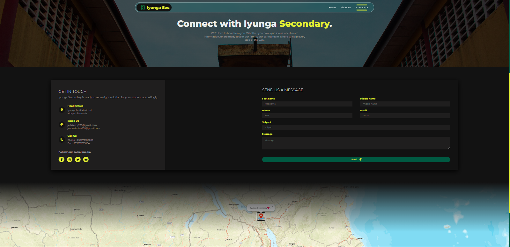

<h1 align="center"><strong>Iyunga Secondary School 🔥 Static Website PROJECT-IPT-2026</strong></h1>

##  **Project-Name**: `Iyunga-Sec-IPT`
### A Technial static website created under lightweight Vanilla languages passed below. on the purpose of serving all School daily activities and [Students Registration Process](https://must.ac.tz)

### Below is the quick Overview of the Project layout on `Contact Us` page example

## 
**Skills Used**

    
       
    

## 
**Assets Involved**

- `Typography`
    - fs-400: 12px
    - fs-500: 14px
    - fs-600: 1.5em
    - fs-700: 3.5e 
    - fw-200:  200
    - fw-400: 400
    - fw-500: 500
    - fw-600: 600
    - fw-700: 700
    - sliding-before: 0rem
    - warm-black: #1f1e1e
- `color palette`
    - ff-primary: 'montserrat'
    - evening-sea: #005840
    - peridot: #D1F843
    - antique-chrome: #ECF0EF
    - black-charcoal: #121212
    - sporty: #e3ef26 
    - gradient-1: linear-gradient(to right, #076653,var(--sporty),#e2fbce)
    - gradient-2: linear-gradient(to right, #0c342c, #076653, var(--sporty)) 
    - gradient-3: linear-gradient(to right, #06231d, #0c342c, #076653) 

## 
**Project Statistics**

<table align="center">
    <tr>
        <td align="center">
            
        </td>
        <td align="center">
            
        </td>
    </tr>
</table>

<h2>
    {<a href="https://github.com/justin24er">justin24er</a>:
    "..crafting full-stack systems that drive growth.."}
</h2>

<h2>&copy;All rights reserved. 2026</h2>

